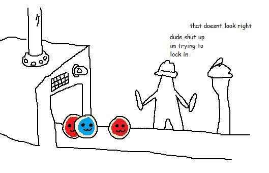

# Apex

Hackable & performant taiko client supporting multiple platforms such as Linux (X11 & Wayland), macOS, Windows and even web using WebAssembly.

  

## Build Instructions
1. Install the **nightly** Rust toolchain: https://rustup.rs
2. Install cargo-make: `cargo install --force cargo-make`
3. Clone the repository: `git clone git@github.com:polina4096/apex.git`
4. Navigate to the cloned repository's directory: `cd apex`
5. Run: `cargo make run-opt`

Please note that the game is **not ready for testing yet**, as there are certain major issues such as some audio formats being only partially supported.

### Development

The game stores and accesses certain data such as assets, beatmaps or configuration from the working directory. If a directory or a file is missing the game creates when needed. Project is setup in a way which stores all game data inside a `debug` directory in a development environment.

Compile and run a development build with: `cargo make` / `cargo make run`

Or with optimizations (takes very long): `cargo make run-opt`

### WebAssembly support

Right now Wasm builds are broken indefinitely due to threading and other issues and fixing them is low priority, please wait for future updates :c

~~Install [wasm-pack](https://rustwasm.github.io/wasm-pack/installer/), build with: `wasm-pack build --release`.~~

~~Navigate to `crates/apex-client/web` and host a local web server with: `pnpm run dev`.~~

## License
Distributed under the MIT license.
